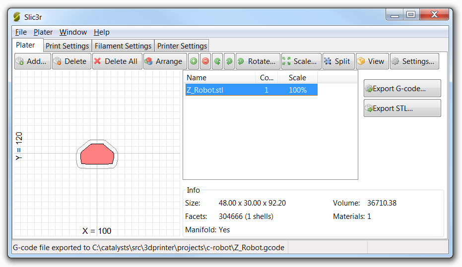
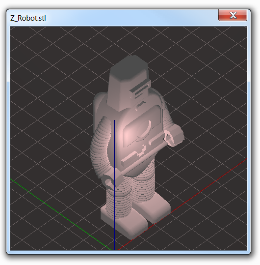
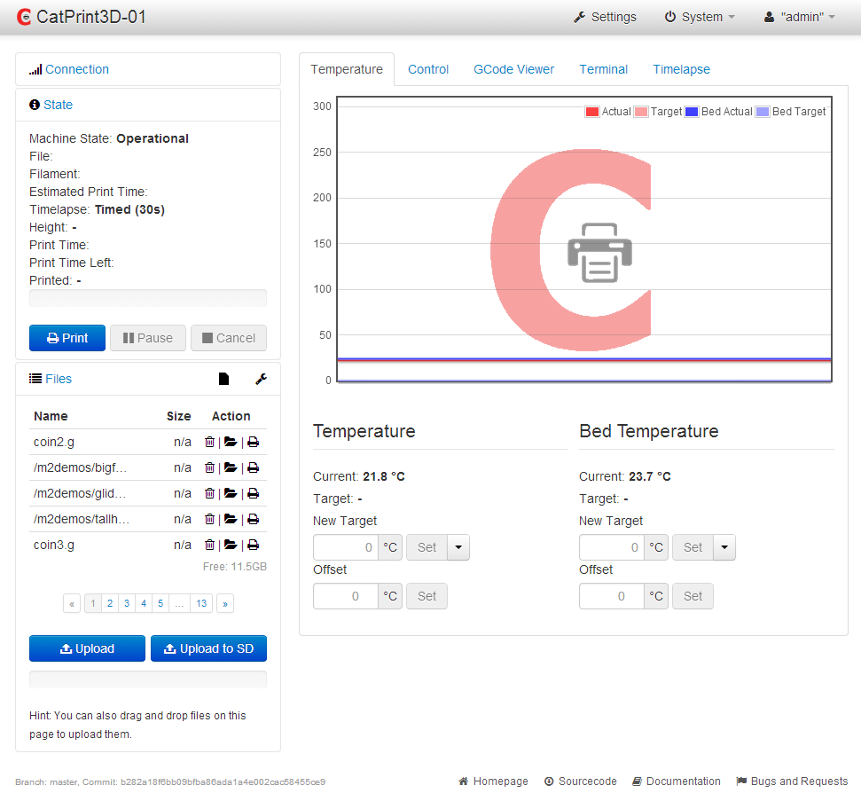
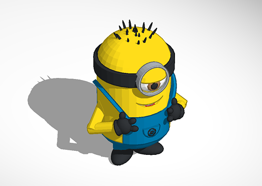

# 3D Printing

## Übersicht

Normalerweise sind folgende drei Schritte eng mit 3D-Druck verbunden:

* Anpassen eines 3D-Modells für den Druck
* Generieren einer G-Code Datei
* Drucken

Dieser Workshop wird sich deshalb genau mit diesen Schritten beschäftigen.

## Vorbereitung

Wir werden einen [*MakeGear M2 Drucker*](http://www.makergear.com/products/m-series-3d-printers) nutzen und [*OctoPrint*](http://octoprint.org/) verwenden um damit zu kummizieren.

* Stelle sicher, dass der 3D-Drucker angesteckt und eingeschaltet ist.
* Verifiziere die Verbindung im [OctoPrint UI](http://catprint3d02.catalysts.local)
* Downloade und installiere [Slic3r](http://slic3r.org/download)

## Main Flow

### Einleitung

> 3D printable models may be created with a computer aided design package or
> via 3D scanner. The manual modelling process of preparing geometric data for
> 3D computer graphics is similar to plastic arts such as sculpting.
> 3D scanning is a process of analysing and collecting digital data on the
> shape and appearance of a real object. Based on this data, three-dimensional
> models of the scanned object can then be produced.

Um Modelle vorzubereiten werden wir Slic3r verwenden.
Wenn du auf einem MakerBot Drucker druckst wirst du wahrscheinlich Replicator G verwenden, für andere Drucker wie zum Beispiel Rep Rap vielleicht Pronterface oder auch Slic3r.

### Aufsetzen von Slic3r

Wenn du Slic3r das erste Mal startest, wird sich der Konfurationsassistent öffnen. Setze folgende Werte:

* G-code flavor: RepRap
* Bed size: 200mm x 240mm
* Nozzle diameter: 0.35mm
* Filament diameter: 1.75mm
* Extrusion temperature: 210C
* Bed temperature: 75C

Jetzt ist Slic3r für die Arbeit mit einem MakeGear Drucker vorbereitet!

### Opening 3D model

Wenn du dein Modell in Slic3r öffnest, wird dir dein Modell auf der Druckplattform/Druckfläche (auch "Bett") angezeigt.
Stelle sicher, dass dein Modell nicht über die Begrenzungen des Betts hinaus ragt oder Überhänge hat. Du kannst ganz einfach weitere Modelle zum Druckbereich hinzufügen und manuell bzw. automatisch vervielfachen (*Arrange*).

 

Du kannst dein modell auch rotieren, skalieren oder sogar teilen, falls es aus mehreren separaten Komponenten besteht und diese neu anordnen.

> It is not recommended to print more than one model at a time because it
> takes proportional time to print and in case of error with printing one of
> pieces you need probably to cancel all printing job.

Über den *View* Button kannst du dir 3D-Ansichten der einzelnen Teile ansehen.

 

Um Standardeinstellungen zu ändern, wähle den *Settings* Knopf. Was du vielleicht ändern möchtest:
 * **Füllmuster und -dichte.**
   Standardmäßig wird eine Wabenstruktur mit 40% verwendet, aber in manchen Fällen möchtest du vielleicht 100% Dichte und ein rechtwinkeliges Muster verwenden.
 * **Stützmaterial**
   Für Modelle mit speziellen Formen, die schwer zu drucken sind, ist es nötig Stützen zu druckeh -- natürlich klann der Druck nicht "in der Luft" beginnen. Manchmal kann es auch reichen, das Modell zu rotieren.

### Things to Remember when Creating a 3D Model

Es gibt einige Dinge, die man im Kopf behalten sollte wenn man ein Modell für den 3D-Druck erzeugt.

Erstens muss das Modell ein festes Objekt sein. Es darf keine Löcher in der äußeren Hülle des Objekts geben. Diese Eigenschaft wird auch als "wasserdicht" bezeichnet.

Außerdem sind Überhänge zu vermeiden.

> Imagine a mushroom. It cannot be able to print on a normal printer. It will
> result in a stringy mess that will hang down below the mantel of the
> mushroom. To be able to print it when generating the g code you can use the
> exterior support option. This is generate an extra layer of support that
> will be printed around the model. The support can be later torn away leaving
> behind some scar marks but still leaving behind a nice models. another
> solution for create models with over hangs is to think about them in 
> a different manner. The mushroom won't be able to print facing right side
> up. But it will print just fine *upside down*.

### Generating a G Code

> G-code is the common name for the most widely used numerical control (NC)
> programming language, which has many implementations. Used mainly in
> automation, it is part of computer-aided engineering. G-code is sometimes
> called G programming language.
> G-code is a language in which people tell computerized machine tools what to
> make and how to make it. The "how" is defined by instructions on where to
> move to, how fast to move, and through what path to move. 

Mit Slic3r lässt sich G-Code generieren. Stelle sicher, dass du das richtige Schneideprofil (*slicing profile*) verwendest und die *skinning preferences* richtig eingestellt sind.

Der generierte G-Code enthält dann die Anweisungen für den Drucker um das Modell zu generieren.
Mit dem Knopf *Export G-code* und der Angabe eines Dateinamens wird die Generierung gestartet. Sobald der Vorgang abgeschlossen ist, wird dir "G-code file exported to ..." in der Statuszeile angezeigt. Der Vorgang kann einige Zeit in Anspruch nehmen. Wenn du die G-Code Datei hast, kannst du sie zum Druck an den Drucker senden.

### Drucken

Wie oben erwähnt werden wir [OctoPrint](http://catprint3d02.catalysts.local) nutzen.

Verbinde dich mit der Weboberfläche und logge dich mit den Zugangsdaten, die dir dein Workshop-Leiter verrät, ein.

Als nächstes ist der G-Code hochzuladen. Wähle *Upload to SD*, markiere eine Datei und clicke *Open*. Du kannst die Datei auch per Drag'n'Drop in die Website ziehen. Der Upload beginnt dann sofort. Danach lädt OctoPrint die Datei an den Drucker hoch, was eine Weile dauern kann. Im *Status*-Tab siehst du die Kommandos die an den Drucker gesendet werden.

> Usually 3D printing takes quite a lot time. That is why it is better to
> upload your G code file immediately to printer SD card. In case of
> communication problems printing job will not be broken.

Nach dem Upload findest du die Datei in der Dateiliste. Clicke auf *Load and print* um den Druck zu starten.

## Weitere Aufgaben

A lot of experience you can get adopting things for 3D printing. As first try you can edit following [Minion](https://tinkercad.com/things/0T6t1YCDULK) model to make it possible to print.

## FAQ

* **I pressed "Load and Print", but printer is not printing.** Probably it is just warming up. Usually it takes few minutes to reach necessary temperature.
* **What happens if I press Pause/Stop buttons during executing print job** Usually it is not good idea to interrupt print, but sometimes it is needed to remove some wrecks from printing bed. If you press Pause you may resume printing by pressing Resume. Cancel will abort printing job and printer will return into initial state - it will not be able to continue.

## Additional resources

* [OctoPrint](http://octoprint.org/)
* [Preparing a Model for 3D Printing](http://3d.about.com/od/Creating-3D-The-CG-Pipeline/ss/Preparing-A-Model-For-3d-Printing-Model-To-3d-Print-In-5-Steps.htm)
* [M2 Getting Started](http://makergear.wikidot.com/m2-getting-started)

# Examples

## Headphones holders

* [Earbud holder](http://www.thingiverse.com/thing:36321)
  
* [Earbug](http://www.thingiverse.com/thing:454707)
  

## Planes

* [Super Stratos](http://www.thingiverse.com/thing:97803)
  

## Robots

* [Robot Puppet](http://www.thingiverse.com/thing:437106)
  
* [Bumper Bot](http://www.thingiverse.com/thing:23682)
  

## Others

* [Yoda](http://www.thingiverse.com/thing:10752)
  
* [Propeller Launcher](http://www.thingiverse.com/thing:312971)
  
* [Open Hardware Keychain](http://www.thingiverse.com/thing:21596)
  
* [Tardis](http://www.thingiverse.com/thing:455188)
  
  
