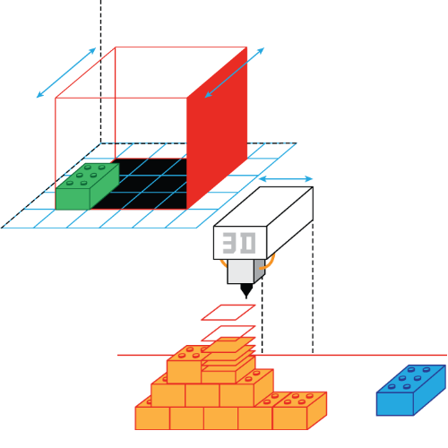

# 3D Modelling'n'Printing

This workshop contains from two big parts:

## Modelling

> 3D modeling is the process of developing a mathematical representation of
> any three-dimensional surface of an object (either inanimate or living)
> via specialized software. The product is called a 3D model. It can be
> displayed as a two-dimensional image through a process called 3D rendering
> or used in a computer simulation of physical phenomena. (c) Wikipedia

[Go to tutorial](modelling.md)

## Printing

> 3D printing or additive manufacturing is any of various processes for making
> a three-dimensional object of almost any shape from a 3D model or other
> electronic data source primarily through additive processes in which
> successive layers of material are laid down under computer control.[2] A 3D
> printer is a type of industrial robot. (c) Wikipedia

[Go to tutorial](printing.md)

## Additional

* [How-to setup Slic3r to work with Makergear M2 3D Printer](MakerGearM2.md)

# Examples

## Headphones holders

* [Earbud holder](http://www.thingiverse.com/thing:36321)
  
* [Earbug](http://www.thingiverse.com/thing:454707)
  

## Planes

* [Super Stratos](http://www.thingiverse.com/thing:97803)
  

## Robots

* [Robot Puppet](http://www.thingiverse.com/thing:437106)
  
* [Bumper Bot](http://www.thingiverse.com/thing:23682)
  

## Others

* [Yoda](http://www.thingiverse.com/thing:10752)
  
* [Propeller Launcher](http://www.thingiverse.com/thing:312971)
  
* [Open Hardware Keychain](http://www.thingiverse.com/thing:21596)
  
* [Tardis](http://www.thingiverse.com/thing:455188)
  
