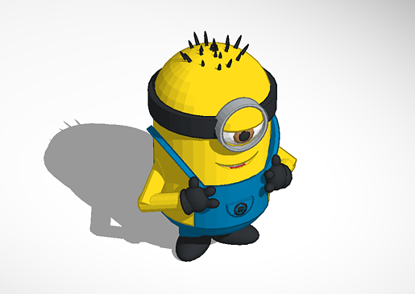

3D Printing
===========

Overview
--------

Usually 3D Printing means doing three basic steps:

* Adopt 3D model to print
* Generate G-code file
* Print

During this workshop you will learn how to do these basic steps.

## Preparations

We will use [*MakeGear M2 printer*](http://www.makergear.com/products/m-series-3d-printers) and [*OctoPrint*](http://octoprint.org/) software to communicate with printer.

* Ensure that 3D printer is powered on
* Check connection to [OctoPrint UI](http://catprint3d02.catalysts.local)
* Download and install [Slic3r](http://slic3r.org/download)

Main flow
---------

### Introduction

> 3D printable models may be created with a computer aided design package or
> via 3D scanner. The manual modelling process of preparing geometric data for
> 3D computer graphics is similar to plastic arts such as sculpting.
> 3D scanning is a process of analysing and collecting digital data on the
> shape and appearance of a real object. Based on this data, three-dimensional
> models of the scanned object can then be produced.

When setting up a model for 3D printing we will use Slic3r.
If you're printing on Makerbot you will probably use Replicator G. If you're printing another 3D printer like Rep Rap you might be using Pronterface or Slicer too.

### Setting up Slic3r

Once you open Slic3r for the first time you will see configuration assistant.

* G-code flavor: RepRap
* Bed size: 200mm x 240mm
* Nozzle diameter: 0.35mm
* Filament diameter: 1.75mm
* Extrusion temperature: 210C
* Bed temperature: 75C

Congratulations! You successfully configured Slic3r to work with MakeGear 3D printer.

### Opening 3D model

Once you open your model in Slicer you see an overview of your build platform.
You'll want to make sure that your model fits in the confines of this build platform and it doesn't stretch out over any of the sides. You can easily add additional models to printing area and spread them automatically (Arrange button) or manually.

 

You can also scale, rotate and even split your model if it contains more than one separate piece and arrange them separately.

> It is not recommended to print more than one model at a time because it
> takes proportional time to print and in case of error with printing one of
> pieces you need probably to cancel all printing job.

You can press View button to 3D representation of separate piece.

 

To redefine default settings press Settings button. You may need it to change:
* Fill pattern and density. By default it use honeycomp and 40% and it is pretty good, but in some cases you will probably need 100% density and rectlinear pattern.
* Support material. In some cases model can have very special shape which can be difficult to print. In these cases you'll have to generate support - it is obvious that printer cannot start his job in the air. Think about it and it is probably better to rotate model to print it easier.

### Things to Remember when Creating a 3D Model

There are few things to keep in mind when creating a 3D model for 3D printing.

One, the model must be a solid object. There can be no holes in the outer skin
of the object. It's also referred to as a water tight object.

The other thing to keep in mind with 3D printing is to make sure you don't
have over hangs for your model. 
> Imagine a mushroom. It cannot be able to print on a normal printer. It will
> result in a stringy mess that will hang down below the mantel of the
> mushroom. To be able to print it when generating the g code you can use the
> exterior support option. This is generate an extra layer of support that
> will be printed around the model. The support can be later torn away leaving
> behind some scar marks but still leaving behind a nice models. another
> solution for create models with over hangs is to think about them in 
> a different manner. The mushroom won't be able to print facing right side
> up. But it will print just fine *upside down*.

### Generating a G Code

> G-code is the common name for the most widely used numerical control (NC)
> programming language, which has many implementations. Used mainly in
> automation, it is part of computer-aided engineering. G-code is sometimes
> called G programming language.
> G-code is a language in which people tell computerized machine tools what to
> make and how to make it. The "how" is defined by instructions on where to
> move to, how fast to move, and through what path to move. 

From Slic3r you can generate your G code. Make sure you're using a proper
slicing profile and that your skinning preferences are set correctly.
Generating your G code will create the language that will talk to the printer
that will create your model. Once you press "Export G-code" button and specify file name, G code generation is started. After it finishes you will see message "G-code file exported to..." in status line. Do not be surprised - sometimes it take a bit time. Once you have G-code file you can send it to your printer to be print.

### Printing

As it was mentioned above we will print using OctoPrint open source software.

Connect to the [web UI](http://catprint3d02.catalysts.local) using your favourite browser. Once you log in you will see OctoPrint UI (which username/password to use you may ask workshop leader).

Next we will upload your G code file to the printer. Press "Upload to SD" button, select a file and press Open. You can also drag and drop file onto web page. After that upload will start immediately. After loading to OctoPrint host (in our case Raspberry PI) it will start uploading to the printer, which can take quite a lot time depending on file size. If you open Status tab you will see commands that are being sent to printer.

> Usually 3D printing takes quite a lot time. That is why it is better to
> upload your G code file immediately to printer SD card. In case of
> communication problems printing job will not be broken.

After uploading you can find your file in the file list. Clicking on "Load and print" button will start printing.

Additional tasks
----------------

A lot of experience you can get adopting things for 3D printing. As first try you can edit following [Minion](https://tinkercad.com/things/0T6t1YCDULK) model to make it possible to print.

FAQ
---

* **I pressed "Load and Print", but printer is not printing.** Probably it is just warming up. Usually it takes few minutes to reach necessary temperature.
* **What happens if I press Pause/Stop buttons during executing print job** Usually it is not good idea to interrupt print, but sometimes it is needed to remove some wrecks from printing bed. If you press Pause you may resume printing by pressing Resume. Cancel will abort printing job and printer will return into initial state - it will not be able to continue.

Additional resources
--------------------

* [OctoPrint](http://octoprint.org/)
* [Preparing a Model for 3D Printing](http://3d.about.com/od/Creating-3D-The-CG-Pipeline/ss/Preparing-A-Model-For-3d-Printing-Model-To-3d-Print-In-5-Steps.htm)
* [M2 Getting Started](http://makergear.wikidot.com/m2-getting-started)

# Examples

## Headphones holders

* [Earbud holder](http://www.thingiverse.com/thing:36321)
  
* [Earbug](http://www.thingiverse.com/thing:454707)
  

## Planes

* [Super Stratos](http://www.thingiverse.com/thing:97803)
  

## Robots

* [Robot Puppet](http://www.thingiverse.com/thing:437106)
  
* [Bumper Bot](http://www.thingiverse.com/thing:23682)
  

## Others

* [Yoda](http://www.thingiverse.com/thing:10752)
  
* [Propeller Launcher](http://www.thingiverse.com/thing:312971)
  
* [Open Hardware Keychain](http://www.thingiverse.com/thing:21596)
  
* [Tardis](http://www.thingiverse.com/thing:455188)
  
  
