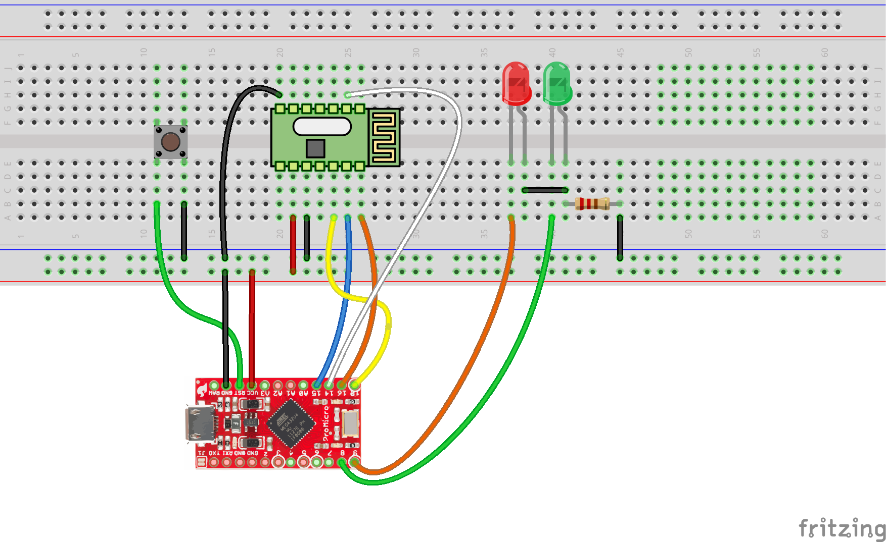

# Drones

In this workshop you will learn how to build a transmitter station to control your drone.

# Requirements

- 1x Arduino Pro Micro
- 1x A7105 RF chip
- 1x Breadboard
- 9x Cables

Optional (reset button):
- 1x Pushbutton
- 2x Cables

Optional (LEDs):
- 2x LEDs
- 1x Resistor
- 4x Cables

# Basic flow

## Build the transmitter station

**Instructions**

1. Attach the A7105 to the middle of the breadboard (see image).
2. Wire the 3.3v of the arduino board to the live rail on the breadboard.
3. Wire the ground pin of the arduino to the ground rail on the breadboard.
4. Connect the VDD pin of the A7105 to the live rail of the breadboard.
5. Connect the two GND pins of the A7105 chip to the ground rail of the breadboard.
6. Wire the MOSI pin of the Arduino board to one end of the 10kΩ resistor
7. Wire the other end of the resistor to the SDIO pin of the A7105
8. Wire gio1 of the A7105 to the MISO port of the Arduino board
9. Wire 'SCK' of the arduino to 'SCK' on the A7105
10. Wire pin 10 of the arduino to 'SCS' on the A7105

**Optional: Add a push button for resetting the arduino:**

1. Attach the push button to the breadboard
2. Wire one side of the push button to the RST pin of the arduino
3. Wire the other side of the push button (as seen in the image) to the ground rail of the breadboard

**Optional: Add LEDs to indicate the binding status:**

1. Add the LEDs, resistors and cables as seen in the image.

## Upload software

### Toolchain setup

Next step is to upload the software, which listens for commands on the serial port and 'talks' to the drone.
If you don't have the Arduino IDE already installed, download the setup and install it: [Arduino IDE 1.0.6](http://arduino.cc/en/main/software#toc2) (don't use the new beta version!).

Before you can upload software to the arduino pro micro, you have to install a driver and an arduino extension: [Pro Micro & Fio v3 Hookup Guide](https://learn.sparkfun.com/tutorials/pro-micro--fio-v3-hookup-guide#installing-windows).

**Basic steps are (for more details and screenshots use the link):**

1. Download the [drivers for arduino pro micro](https://github.com/sparkfun/SF32u4_boards/raw/master/driver/ProMicro.inf) (note: save file as `.inf`, not `.txt`!)
2. Plug in the arduino board. Windows will search for drivers and it will fail (but don't worry, see next step)
3. Open the device manager, select the `USB IO Board`, select `Update driver software`, and choose the folder where you have saved the `ProMicro.inf` file.
4. Download the [arduino IDE extension for arduino pro micro](https://github.com/sparkfun/SF32u4_boards/archive/master.zip), extract it, rename the folder to `SF32u4_boards` and place it inside the `C:\Users\<your username>\Documents\Arduino\hardware` folder.

### Upload the code

1. Download the prepared sourcecode from https://github.com/andihit/coptermanager-simple/archive/master.zip (and extract the zip file)
2. Open the `arduino.ino` file from the `arduino` folder.
3. Select `Tools` -> `Board` -> `SparkFun Pro Micro 3.3V/8Mhz` (please take care and **don't** select another board)
4. Select the correct serial port from `Tools` -> `Serial Port` (if you have more ports to choose, you have to make an educated guess. Or just try every port :)).
5. Click the upload button (the button with the arrow).

## Start the ground station

### Setup

1. If you don't have node.js and npm installed, please install it: http://nodejs.org
2. Open a shell and execute `npm install -g bower` and `npm install -g gulp`
3. Navigate to the directory where you downloaded the source code from the last section.
4. Open a shell and execute `bower install`, `npm install`, `npm link`.
5. Open a shell with administrator privileges and execute `npm link coptermanager-simple`

### Start the ground station

1. Execute `node start-repl.js` inside the directory with the sourcecode.

# Advance flow

**The ground station includes a simple web API, example commands:**

    ascend/descend, possbible values: 0x00 - 0xFF (smaller is down)
    http://<your ip>/api/control?throttle=40

    rotate left/right, possible values: 0x34 - 0xCC (smaller is right)
    http://<your ip>/api/control?rudder=127

    drift sideways left/right, possible values: 0x45 - 0xC3 (smaller is right)
    http://<your ip>/api/control?aileron=127

    forward/backward, possible values: 0x3E - 0xBC (smaller is up)
    http://<your ip>/api/control?elevator=127

    led on/off
    http://<your ip>/api/setting?led=off

    flip on/off
    http://<your ip>/api/setting?flip=off

**Some ideas:**

- Use a webcam to find the LEDs and keep the quadrocopter hovered (if it drifts, send a command to fly to the opposite direction)
- Create an mobile app to control the drone with your mobile phone or tablet (connect to the same WiFi network and use the web API)

# Links
* [Original Tutorial for building a drone, control it with an Arduino Due and code examples](www.instructables.com/id/Easy-Android-controllable-PC-Interfaceable-Relati/)
