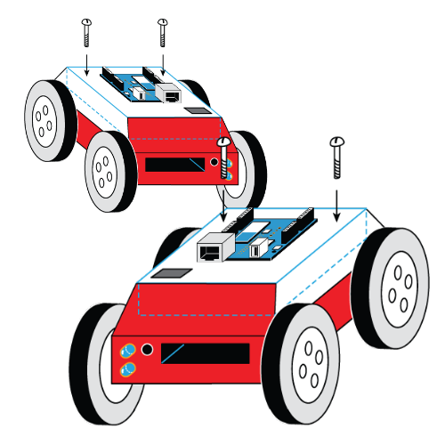

# Build-a-Bot Tutorial

* [Components](#user-content-components)
* [Basic flow](#user-content-basic-flow)
  * [LED blinking](#user-content-led-blinking)
  * [Connect IR sensor](#user-content-connect-ir-sensor)
  * [Connect servo](#user-content-connect-servo)
  * [Power it with batteries](#user-content-power-it-with-batteries)
  * [Build robot body](#user-content-build-robot-body)
  * [Program robot](#user-content-program-robot)
  * [Shuttle run](#user-content-shuttle-run)
  * [Move along straight way](#user-content-move-along-straight-line)
  * [Snake moving](#user-content-snake-moving)
* [Advanced flow](#user-content-advanced-flow)
  * [Line following](#user-content-line-following)
  * [Robotic sumo](#user-content-robotic-sumo)
* [FAQ](#user-content-faq)
* [Links](#user-content-links)
* [Appendix 1. LED blinking example](#user-content-appendix-1-led-blinking-example)
* [Appendix 2. IR calibration](#user-content-appendix-2-ir-calibration)
* [Appendix 3. Control servo](#user-content-appendix-3-control-servo)
* [Appendix 4. Two servos](#user-content-appendix-4-two-servos)
* [Appendix 5. Basic bot](#user-content-appendix-5-basic-bot)
* [Appendix 6. Line following](#user-content-appendix-6-line-following)

This tutorial will guide you through the process of creating autonomous wheeled robots.

# Components

1. Arduino UNO R3 x1
2. USB cable x1
3. Mini solderless breadboard x1
4. IR sensor x1
5. Continuous rotation servo x2
6. Battery holder x1
7. AA battery x4
8. Bunch of color wires

# Basic Flow
## LED Blinking

You will start with some basic Arduino example.

First of all you need to install Arduino IDE. The [Getting Started Guide](http://arduino.cc/en/Guide/HomePage) from the official Arduino website will tell you everything about it. Once you have installed Arduino IDE you can start writing your own programs for Arduino (often called sketches). We'll use a language based on C to program our Arduino.

Let's start.

1. Open Arduino IDE. By default it will show an empty sketch.

  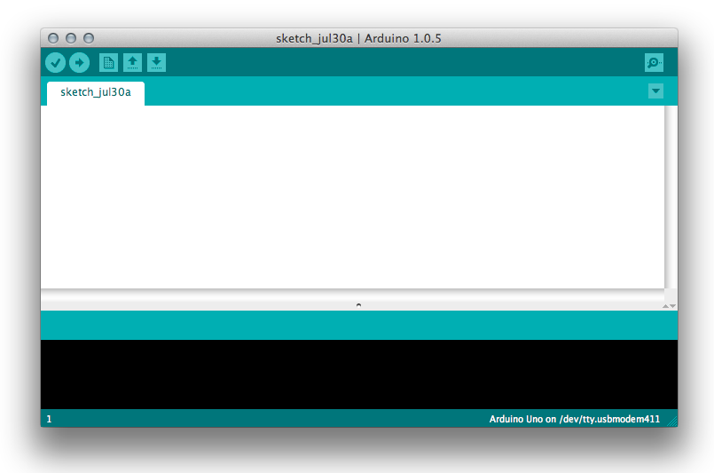

1. Open example sketch via *File &rarr; Examples &rarr; 01.Basics &rarr; Blink* (or see [Appendix 1](#appendix-1-led-blinking-example)).

1. Compile this example (*Sketch &rarr; Verify/Compile*).
   You'll see "Done compiling" and the size of the binary in bytes when the compilation is completed.

1. Connect your Arduino board to your laptop using a USB cable.
   After that you will see some connected device in *Tools &rarr; Serial Port*. Select it.
   Now you are able to upload your sketch to the Arduino board.

1. To start uploading simply press the Upload button on the toolbar or choose *File &rarr; Upload*.
   Arduino will start blinking its TX/RX LEDs and after a few seconds your sketch will have finished uploading indicated by "Done uploading" and the LEDs not flashing anymore.

Congratulations! You have just uploaded your first program to the microcontroller.

## Connect IR sensor

There is a wide range of different sensors that can be used with Arduino.

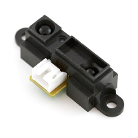

You will use a Sharp infrared distance sensor (GP2Y0A21YK0F) to measure distances of objects to your robot. Its range is restricted from 10cm to 80cm.

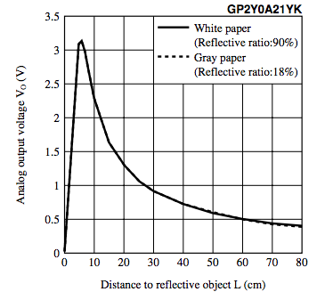

It's easy to connect this sensor to Arduino. Take a look at the following picture.

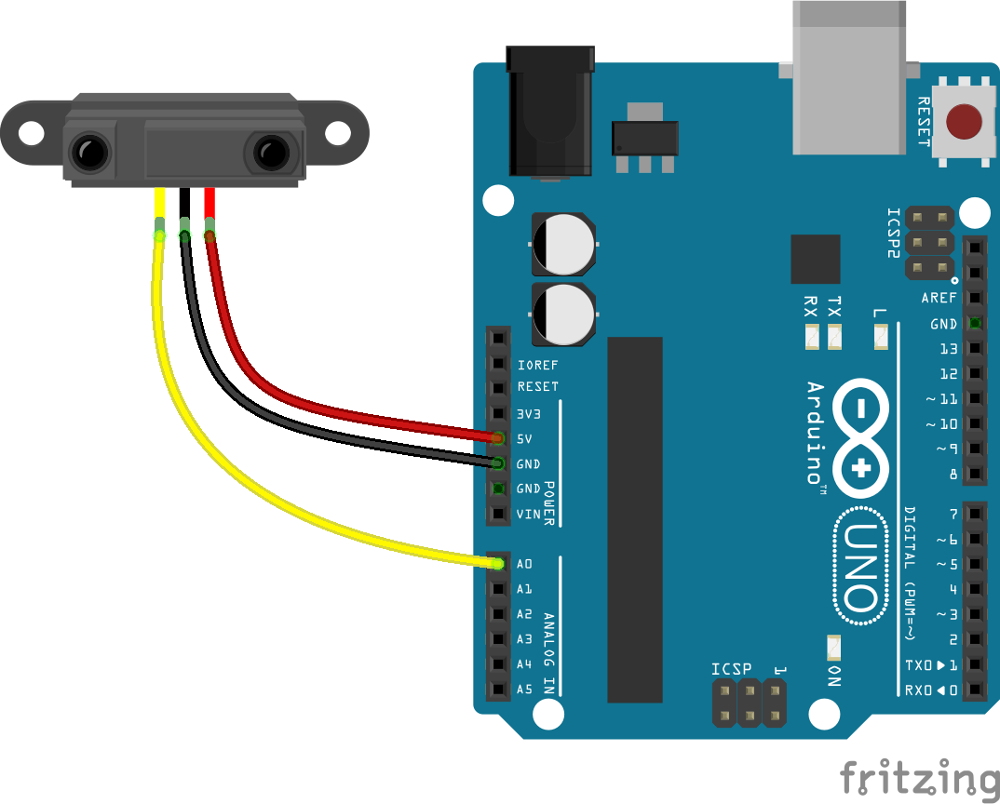

Connect wires as shown:
* + (red wire) to +5V pin
* ground (black wire) to one of the GND pins
* signal (yellow wire) to pin A0

You will use the sketch from [Appendix 2](#appendix-2) to calibrate your IR distance sensor.

The sketch converts the voltage values read from the first analog pin (A0) to distances in centimeters. To achieve that, it uses a prefilled table (2-dimensional array) that maps the measured value to its corresponding length in centimeters. It's important to note that Arduino uses a 10-bit analog to digital converter. This means that the value read from the analog pins (0V to 5V) will be translated into integer values between 0 and 2<sup>10</sup> - 1 = 1023.
If you open *Tools &rarr; Serial Monitor* after compiling and uploading the sketch, you will see the current analog value and the corresponding distance to the object in front of the sensor.

You can check the measurement by placing an object aligned to a ruler and matching the output from the Serial Monitor. If it's not enough precise, you should tune the values in the table until you reach the level of precision you need.

Congratulations! You just learned how to read the output of an IR distance sensor!

## Connect Servo Motors

There are a wide range mechanisms that can help our robot to move. The most commonly used are DC motors, stepper motors and servos. You will use continuous rotation servos for that.

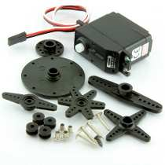

Servo motors typically have three wires: power (red), ground (black or brown) and signal (yellow, orange or white). Connect them as follows:
 * power to the +5V pin on the Arduino board
 * ground to a GND pin on the Arduino board
 * signal to a digital pin on the Arduino board

If you want to learn how the work, you may be interested in [this article](http://www.servocity.com/html/how_do_servos_work_.html).

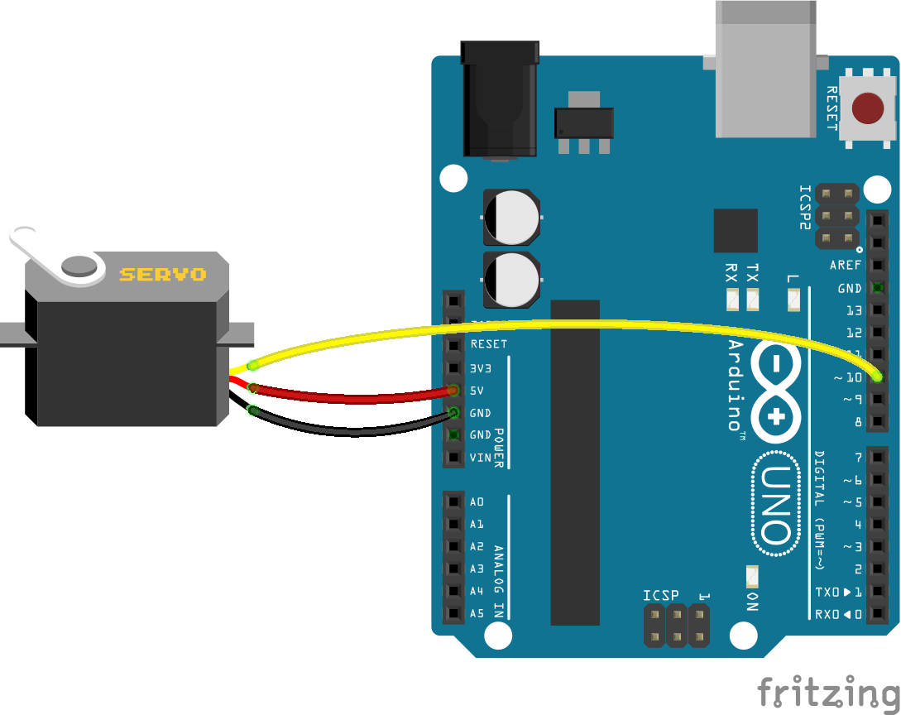

At first you will calibrate the servos. Calibration can be performed in software and hardware. In the first case you'll have to do adjustments with the potentiometer. In the latter case you want to adjust pulse by changing the parameters passed to the `writeMilliseconds` function. Later you will control two servos, so we suggest that you calibrate the potentiometer to match the software, in order to have the same base value for both motors.

The sketch from [Appendix 3](#appendix-3-control-servo) will help us calibrating our servos. Change it to run the servo on zero speed and[c] adjust the potentiometer position to ensure that at zero speed there's really no rotation.

Then you will connect two servos at once to control them simultaneously. Take a look at the following picture.

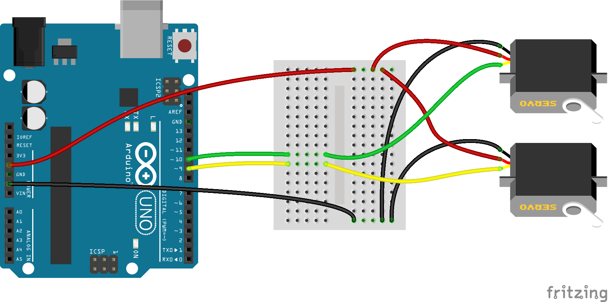

You need to slightly change the sketch to control both servos simultaneously. Check out [Appendix 4](#appendix-4-two-servos) for the complete code.

## Power it with Batteries

Until now you used power from USB. In order to let your robot drive around freely you will need some portable source of energy: Four AA batteries will be used for each robot.

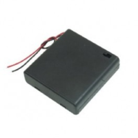

Plug the positive (red) cable into VIN, and the negative (black) cable into one of the GND pins of your Arduino board. The Arduino board has a built-in voltage regulator and may work with 5V to 20V on VIN (though 7V through 12V are recommended).

Connect everything as shown in the picture below:

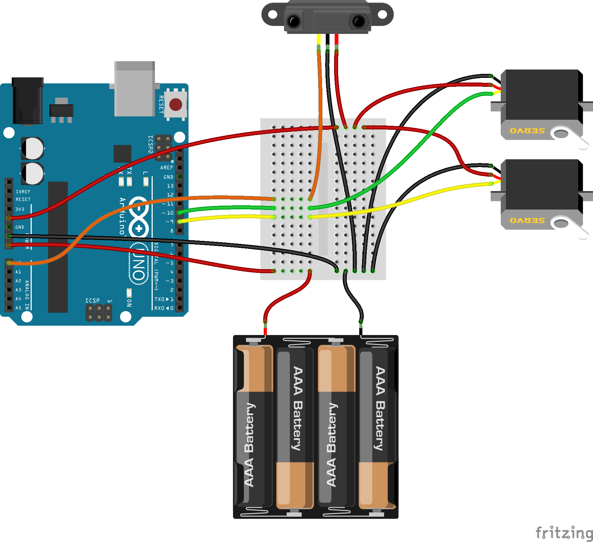

Make sure you connect everything properly and then turn the battery switch to ON.

Note that servos consume a considerable amount of power, so if you need to drive more than one or two, you'll probably need to power them from a separate supply (not the +5V pin on your Arduino). Be sure to connect the grounds of the Arduino and the external power supply.

# Build the Robot's Body

Several parts have been prepared to build your Robot's "body":
 1. Main parts of construction (cut from wood or plexiglass)
 1. Screws and nuts to fix servos, IR sensor and wheels
 1. Wheels (printed on 3D printer)
 1. Tires (rubber rings)

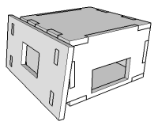

At first fixate the servos to the side panels with screws (12mm M2). Pay attention that the servo shaft should align closer to the backside of the robot body. Then fix the IR sensor on the front panel also with screws (6mm M3). Then pull all the wires through holes in front and back panels so that all of them come out on the back. Then take mini breadboard and stick it with 2-sided adhesive tape on back panel.

Use three screws (12mm M2) to mount the Arduino board on top of the body. You can put small piece of material between panel and board to avoid contact between their surfaces (or just to fit it better). Small plastic spacers are also an option.

Fix together wheel and round fasteners with screws. Then put rubber ring on the wheel. Put wheel on the servo shaft and fix with screw.

Congratulations! It is almost done!

## Program robot

In the first implementation you will try to achieve following:
 * avoid obstacles
 * avoid table edges

You are restricted to use only one sensor.

In the first picture you can see that in normal state when the robot moves along the surface, the distance to the nearest obstacle is equal to the distance of the surface itself.

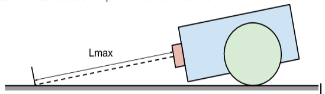

If our robot will reach some object lying on the surface, the distance is much less than the default distance to the surface (Lmax).

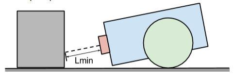

So the easiest way to reach our first goal is to keep our robot moving within this distance range.

Similarly you can reach the second goal - avoid table edges. If the distance is more than Lmax it is more likely that the robot is directing to the table edge.

Let's define two basic rules:
* when distance to obstacle (D) within range Lmin and Lmax robot will move straight forward
* when D is greater than Lmax or less than Lmin robot will rotate until it finds direction with D lying within safe range

The robot has 2 wheels. It will drive under the most basic algorithm for a robot - differential drive:
* to drive straight both wheels move forward at equal speed
* to drive reverse both wheels move back at equal speed
* to turn left the left wheel moves in reverse and the right wheel moves forward
* to turn right the right wheel moves in reverse and the left wheel moves forward

In your case servos are placed in opposite directions so that for one of them robot forward moving means clockwise rotation, for another one - counter-clockwise. Try to keep this in mind.

Take a look at the example sketch in [Appendix 5. Basic bot](#appendix-5-basic-bot).

Let’s start implementing custom behaviour.

## Stay on distance

The task is to change the robot's behaviour so that it holds same distance to an obstacle when the obstacle is moving back and forth.

## Shuttle run

Your task is to make the robot moving forth and back. Focus on moving exactly the same distance and return back to the start position.

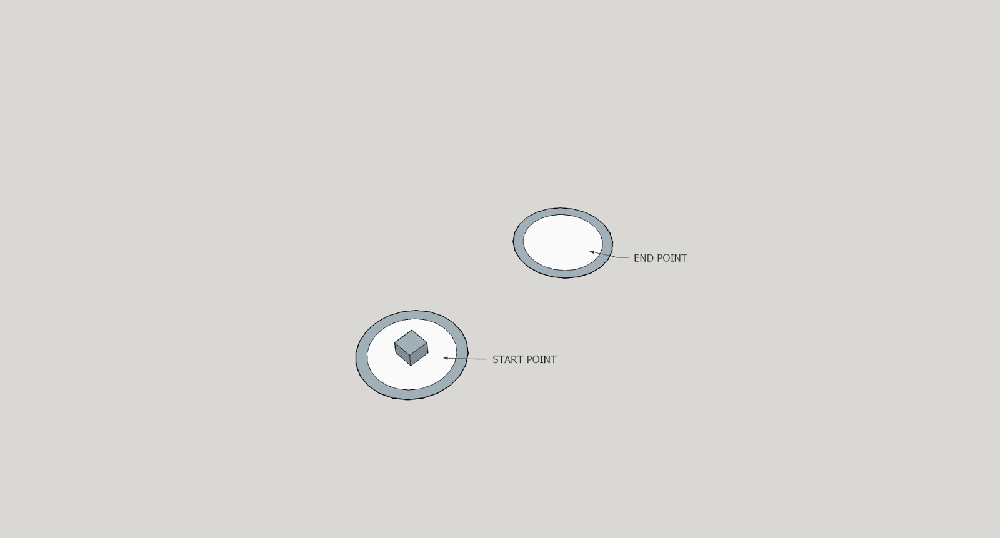

The idea is to implement precise control - moving straight for N centimeters and to rotate exact 180 degrees.

# Move along straight way

Now imagine our robot overcomes a bridge. If you implemented calibration well enough it is not a problem to move straight.

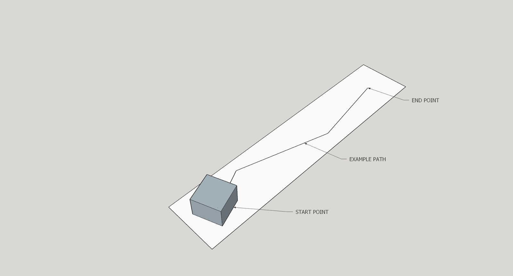

# Snake moving

Imagine you are in a tunnel. To find an exit the robot will move repeating bends of route. You can implement kind of a PID (proportional-integral-derivative) controller.

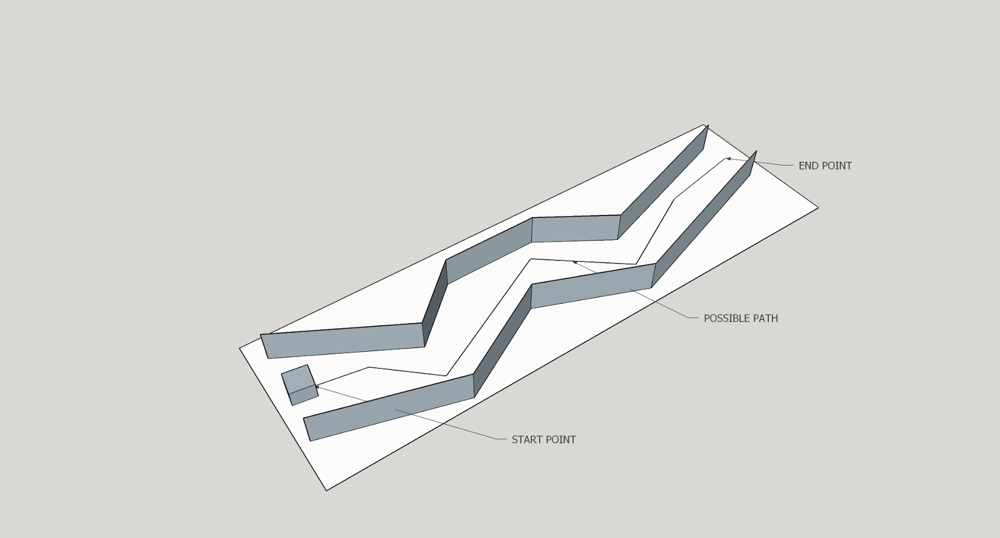


# Advanced flow

# Line following

We are going to make our robot moving along black line on white surface. To reach that goal we will use line detection modules.

Typically line detection module consists from 2 parts - light emitter and linght sensor. First emits linght onto surface and the second checks if the light was reflected. Depending on surface reflection factor (or color) it will return the value.

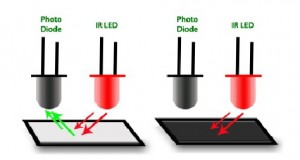

Algorithm we are going to use is fairly simple - we want to keep black line to be between sensors. Algorithm steps:
* if left sensor is abowe line - turn left
* if right sensor is above line - turn right
* if no or all sensors is above line - move forward

These steps are displayed on following picture

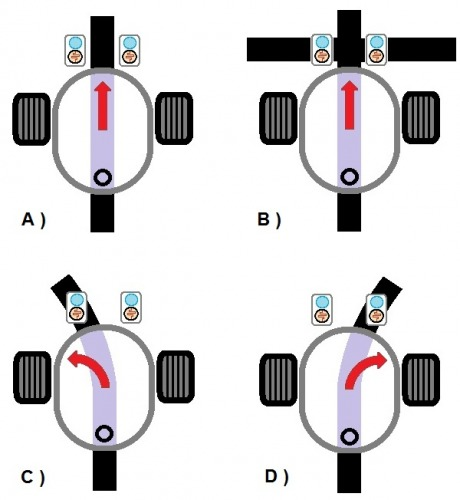

You can find a program in [Appendix 6](#user-content-appendix-6-line-following).

Congrats!!! You just created line follower robot!

## Robotic sumo

Robotic sumo is a competition in which robots are trying to push the opponent out of a circle. There are different categories (depending on robot sizes) and types of rules.


# FAQ

## How does the IR distance sensor work?

These rangers all use triangulation and a small linear CCD array to compute the distance and/or presence of objects in the field of view. In order to triangulare, a pulse of IR light is emitted. The light travels out into the field of view and either hits an object or just keeps on going. In the case of no object, the light is never reflected, and the reading shows no object. If the light is reflected by an object, it returns to the detector and creates a triangle between the point of reflection, the emitter and the detector.
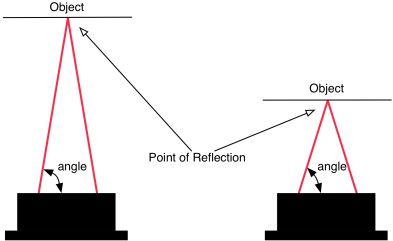

The incident angle of the reflected light varies based on the distance to the object. The receiver portion of the IR rangers is a precision lens that transmits reflected light onto various portions of the enclosed linear CCD array based on the incident angle of the reflected light. The CCD array can then determine the incident angle, and thus calculate the distance to the object. This method of ranging is very immune to interference from ambient light and offers indifference to the color of the object being detected.

## Why do we use servos?
In comparison with DC motor servos can be controlled more easily.

## What is role of PWM in controlling servos?
Take a look on following picture. You may see a signal of rectangular form which has 2 characteristics: pulse width and period.

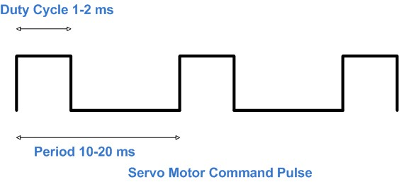

Typically servos are controlled by PWM signal with fixed period. By controlling pulse width we can control servo.

# Links

* [How to Build Your First Robot Tutorial](http://www.societyofrobots.com/robot_tutorial.shtml)
* [How to use sharp IR sensor with arduino](http://communityofrobots.com/tutorial/kawal/how-use-sharp-ir-sensor-arduino)
* [Infrared IR ranger comparison](http://www.acroname.com/articles/sharp.html)
* [Sharp GP2Y0A21YK datasheet](http://www.sharpsma.com/download/GP2Y0A21YK-DATA-SHEETPDF)
* [Parallax Continuous Rotation Servo](http://learn.parallax.com/KickStart/900-00008)
* [Pulse WIdth Modulation](http://en.wikipedia.org/wiki/Pulse-width_modulation)
* [Operating Two Servos with the Arduino](http://www.robotoid.com/appnotes/arduino-operating-two-servos.html)
* [Arduino’s Servo Library: Angles, Microseconds, and “Optional” Command Parameters](http://makezine.com/2014/04/23/arduinos-servo-library-angles-microseconds-and-optional-command-parameters/)
* [Powering Arduino with a Battery](http://www.instructables.com/id/Powering-Arduino-with-a-Battery)
* [PID controller](http://en.wikipedia.org/wiki/PID_controller)
* [Sumo Rules](http://www.robotroom.com/SumoRules.html)
* [Line Follower Rules](http://www.robotchallenge.org/fileadmin/user_upload/_temp_/RobotChallenge/Reglement/RC-LineFollower.pdf)
* [Mini Sumo Robot with Proximity Sensors](http://mcuoneclipse.com/2013/09/08/mini-sumo-robot-with-proximity-sensors/)
* [Unified Sumo Robot Rules](http://robogames.net/rules/all-sumo.php)


# Appendix 1. LED blinking example

```c++
int led = 13; // pin 13 has an LED connected on most Arduino boards.
void setup() { // the setup routine runs once when you press reset:
  pinMode(led, OUTPUT); // initialize the digital pin as an output.
}
void loop() { // the loop routine runs over and over again forever:
  digitalWrite(led, HIGH);   // turn the LED on (HIGH is the voltage level)
  delay(1000);               // wait for a second
  digitalWrite(led, LOW);    // turn the LED off by making the voltage LOW
  delay(1000);               // wait for a second
}
```

# Appendix 2. IR calibration

```c++
int dist_table[][2] = { // calibration table cm to analog value
  {5, 630}, {10, 500}, {15, 340}, {20, 250}, {25, 200},
  {30, 180}, {35, 170}, {40, 140}, {50, 120}, {55, 115},
  {60, 106}, {65, 102}, {70, 98}, {75, 94}, {80, 90}
};

int filter(int prev, int curr) { // filter function
  const float filterVal = 0.1;
  return (int)((float)curr * filterVal + (float)prev * (1 - filterVal));
}

int distance(int pin) { // get current distance from sensor
  const int tries = 10, ms = 1;
  int val = analogRead(pin);
  for (int i = 1; i < tries; i++) { // approximate several values taken with delay
    val = filter(val, analogRead(pin));
    delay(ms);
  }
  int len = sizeof(dist_table) / sizeof(dist_table[0]);
  for (int i = 0; i <= len; i++) { // find closest value in table and interpolate if possible
    if (val >= dist_table[i][1]) {
      if (i > 0) {
        return map(val, dist_table[i][1], dist_table[i-1][1], dist_table[i][0], dist_table[i-1][0]);
      } else {
        return dist_table[i][0];
      }
    }
  }
  return dist_table[len - 1][0];
}

void setup() {
  pinMode(A0, INPUT);
  Serial.begin(9600);
}

void loop() {
  delay(500);
  int curr_dist = distance(A0);
  Serial.print("Analog value: ");
  Serial.print(analogRead(A0));
  Serial.print(". Distance (cm): ");
  Serial.println(curr_dist);
}
```

# Appendix 3. Control servo

```c++
#include <Servo.h>


#define NEUTRAL 1500 // pulse width for servo at zero speed
#define MAX_SPEED 300 // diff +/- for pulse width between zero and max speed
#define MAX_FORWARD NEUTRAL+MAX_SPEED // pulse width for max counter-clockwise speed
#define MAX_BACKWARD NEUTRAL-MAX_SPEED // pulse width for max clockwise speed


Servo servo; // servo object


int current = NEUTRAL; // current pulse length of control signal in microseconds
int step = 10;         // change pulse width on "step" microseconds at a time


void setup() {
  servo.attach(9); // attach servo to pin 9
  Serial.begin(9600);
  servo.writeMicroseconds(current); // set default speed - servo should stay not moving
  delay(5000);  // for 5 seconds
}
void loop() { // then we start spinning forth and back
  current += step; // changing pulse length
  if (current < MAX_BACKWARD || current > MAX_FORWARD) {
    step = -step;
  }
  servo.writeMicroseconds(current);
  Serial.println(current);
  delay(100);
}
```

# Appendix 4. Two servos

```c++
#include <Servo.h>


#define NEUTRAL 1520 // pulse width for servo at zero speed
#define MAX_SPEED 300 // diff for pulse width between zero and max speed
#define MAX_FORWARD NEUTRAL+MAX_SPEED // pulse width for max counter-clockwise speed
#define MAX_BACKWARD NEUTRAL-MAX_SPEED // pulse width for max clockwise speed


Servo leftServo, rightServo;


int current = NEUTRAL;
int step = 10;


void setup() {
  leftServo.attach(10); // attach left servo to pin 10
  rightServo.attach(9); // attach right servo to pin 9
  Serial.begin(9600);
  leftServo.writeMicroseconds(current);
  rightServo.writeMicroseconds(current);
  delay(5000);
}


void loop() {
  current += step;
  if (current < MAX_BACKWARD || current > MAX_FORWARD) { step = -step; }
  leftServo.writeMicroseconds(current);
  rightServo.writeMicroseconds(current);
  Serial.println(current);
  delay(100);
}
```

# Appendix 5. Basic bot

```c++
#include <Servo.h>

#define NEUTRAL 1500 // pulse width for servo at zero speed
#define MAX_SPEED 300 // diff for pulse width between zero and max speed
#define MAX_FORWARD NEUTRAL+MAX_SPEED // pulse width for max counter-clockwise speed
#define MAX_BACKWARD NEUTRAL-MAX_SPEED // pulse width for max clockwise speed

#define LED 13 // on-board Arduino LED

// Move directions
#define UNKNOWN -1
#define FORWARD 0
#define LEFT 1
#define RIGHT 2
#define BACKWARD 3

// IR sensor values
#define TOO_FAR 300 // to far to obstacle - probably table edge
#define TOO_CLOSE 500 // too close to obstacle

Servo rightServo;
Servo leftServo;

void attachServos() {
  if (!rightServo.attached()) { rightServo.attach(9); }
  if (!leftServo.attached()) { leftServo.attach(10); }
}


void move(int dir) {
  switch (dir) {
    case FORWARD:
      rightServo.writeMicroseconds(MAX_BACKWARD);
      leftServo.writeMicroseconds(MAX_FORWARD);
      break;
    case LEFT:
      rightServo.writeMicroseconds(MAX_BACKWARD);
      leftServo.writeMicroseconds(MAX_BACKWARD);
      break;
    case RIGHT:
      rightServo.writeMicroseconds(MAX_FORWARD);
      leftServo.writeMicroseconds(MAX_FORWARD);
      break;
    case BACKWARD:
      rightServo.writeMicroseconds(MAX_FORWARD);
      leftServo.writeMicroseconds(MAX_BACKWARD);
      break;
    default:
      rightServo.writeMicroseconds(NEUTRAL);
      leftServo.writeMicroseconds(NEUTRAL);
  }
}


int checkDistance() {
  // TODO: implement filter and conversion to cm
  return analogRead(A0);
}


void setup() {
  pinMode(A0, INPUT);
  pinMode(LED, OUTPUT);
  attachServos();
  Serial.begin(9600);
}


int currentDirection = UNKNOWN;


void loop() {
  int sensorValue = checkDistance(); // get value from ir sensor
  // Note: check IR sensor voltage diagram
//  Serial.println(dist); // DEBUG: print distance
  if (sensorValue < TOO_FAR) {
    currentDirection = BACKWARD; // possible table edge - move backward
  } else if (sensorValue > TOO_CLOSE) {
    if (currentDirection == 0) { // too close - rotate
      randomSeed(millis()); // in random direction
      currentDirection = random(1, 3); // LEFT or RIGHT
    }
  } else {
    currentDirection = FORWARD; // otherwise - move forward
  }
  digitalWrite(LED, currentDirection != FORWARD); // indicate danger
  move(currentDirection);
  delay(500); // half-second delay
}
```

# Appendix 6. Line following

```c++
/**
* Basic line-following algorithm
*/
#include <Servo.h>

//#define DEBUG // uncomment line to get debug info

// servo is controlled with PWM signal with pulse width from 1000 to 2000 microseconds
#define NEUTRAL 1500 // pulse width for servo at zero speed
#define MAX_SPEED 50 // diff for pulse width (from 0 to 500 (max speed))
#define MAX_FORWARD NEUTRAL+MAX_SPEED // pulse width for max counter-clockwise speed
#define MAX_BACKWARD NEUTRAL-MAX_SPEED // pulse width for max clockwise speed

#define LED 13 // on-board Arduino LED

// Move directions
#define UNKNOWN -1
#define FORWARD 0
#define LEFT 1
#define RIGHT 2
#define BACKWARD 3

Servo rightServo;
Servo leftServo;

void attachServos() {
  if (!rightServo.attached()) { rightServo.attach(9); }
  if (!leftServo.attached()) { leftServo.attach(10); }
}

void move(int dir) {
  switch (dir) {
    case FORWARD:
      rightServo.writeMicroseconds(MAX_BACKWARD);
      leftServo.writeMicroseconds(MAX_FORWARD);
      break;
    case LEFT:
      rightServo.writeMicroseconds(MAX_BACKWARD);
      leftServo.writeMicroseconds(MAX_BACKWARD);
      break;
    case RIGHT:
      rightServo.writeMicroseconds(MAX_FORWARD);
      leftServo.writeMicroseconds(MAX_FORWARD);
      break;
    case BACKWARD:
      rightServo.writeMicroseconds(MAX_FORWARD);
      leftServo.writeMicroseconds(MAX_BACKWARD);
      break;
    default:
      rightServo.writeMicroseconds(NEUTRAL);
      leftServo.writeMicroseconds(NEUTRAL);
  }
}

#define LINE_LEFT 5
#define LINE_CENTER 6
#define LINE_RIGHT 7

int checkLine(int pos) {
  return digitalRead(pos);
}

void setup() { 
  pinMode(A0, INPUT);
  pinMode(LED, OUTPUT);
  attachServos();
#ifdef debug
  Serial.begin(9600);
#endif
} 

int currentDirection = UNKNOWN;

void loop() { 
  // read sensors
  int l = checkLine(LINE_LEFT);
  int c = checkLine(LINE_CENTER);
  int r = checkLine(LINE_RIGHT);
#ifdef DEBUG
  Serial.print(r);
  Serial.print(c);
  Serial.println(l);
#endif
  // main algorithm
  if (l == LOW && r == HIGH) {
    currentDirection = LEFT;
  } else if (l == HIGH && r == LOW) {
    currentDirection = RIGHT;
  } else {
    currentDirection = FORWARD; 
  }
  // indicate getting back on path
  digitalWrite(LED, currentDirection != FORWARD);
  move(currentDirection);
  delay(50); // 50 ms delay
}
```

