# Build-a-Bot Tutorial

* [Components](#user-content-components)
* [Basic flow](#user-content-basic-flow)
  * [LED blinking](#user-content-led-blinking)
  * [Connect IR sensor](#user-content-connect-ir-sensor)
  * [Connect servo](#user-content-connect-servo)
  * [Power it with batteries](#user-content-power-it-with-batteries)
  * [Build robot body](#user-content-build-robot-body)
  * [Program robot](#user-content-program-robot)
  * [Shuttle run](#user-content-shuttle-run)
  * [Move along straight way](#user-content-move-along-straight-line)
  * [Snake moving](#user-content-snake-moving)
* [Advanced flow](#user-content-advanced-flow)
  * [Robotic sumo](#user-content-robotic-sumo)
  * [Line following](#user-content-line-following)
* [FAQ](#user-content-faq)
* [Links](#user-content-links)
* [Appendix 1. LED blinking example](#user-content-appendix-1-led-blinking-example)
* [Appendix 2. IR calibration](#user-content-appendix-2-ir-calibration)
* [Appendix 3. Control servo](#user-content-appendix-3-control-servo)
* [Appendix 4. Two servos](#user-content-appendix-4-two-servos)
* [Appendix 5. Basic bot](#user-content-appendix-5-basic-bot)


This tutorial will guide you through the process of creating autonomous wheeled robots.

# Components

1. Arduino UNO R3 x1
2. USB cable x1
3. Mini solderless breadboard x1
4. IR sensor x1
5. Continuous rotation servo x2
6. Battery holder x1
7. AA battery x4
8. Bunch of color wires


# Basic flow
## LED blinking

You will start with basic Arduino example.

First of all you need to install Arduino IDE. [Getting Started Guide](http://arduino.cc/en/Guide/HomePage) from official website will tell you everything about it. Once you have installed Arduino IDE you can start writing your own program for Arduino (which is called sketch). Arduino IDE uses C/C++ like language.

Let’s start.
* Open Arduino IDE. By default it will open empty sketch.

  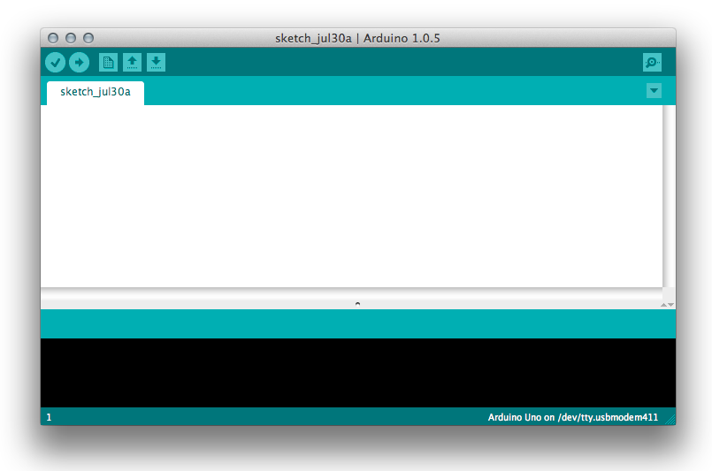

* Open example sketch from File > Examples > 01.Basics > Blink (or see [Appendix 1](#appendix-1-led-blinking-example)).

* Compile this example (Sketch > Verify/Compile).
  After compiling you’ll see “Done compiling” and binary sketch size in bytes.

* Connect your Arduino board to laptop with USB cable.
  After that you will see connected device in menu Tools > Serial port. Select it.
  Now you are able to upload your sketch to Arduino board.

* To start uploading simply press Upload button on toolbar or choose File > Upload.
  Arduino will start blinking by TX/RX leds and after a few seconds your sketch will be uploaded - you will see status “Done uploading” and blinking led on Arduino board.

Congratulations! You have just uploaded your program to the microcontroller.


## Connect IR sensor

There is a wide range of different sensors which can be used with Arduino.

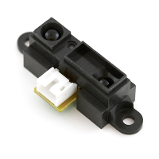

You will use Sharp infrared distance sensor (GP2Y0A21YK0F) which can measure distance to the object. Its range is restricted: 10 to 80 centimeters.

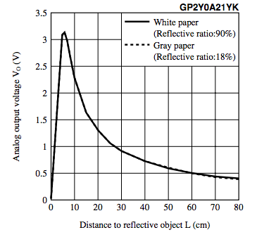

It’s easy to connect this sensor to Arduino. Take a look on following picture.

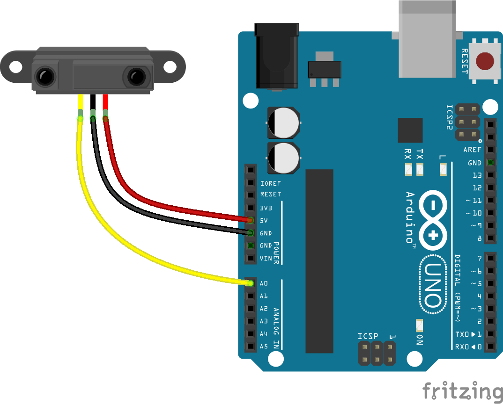

Connect wires as shown:
* + (red wire) to +5V pin
* ground (black wire) to one of GND pins
* signal (yellow wire) to pin A0


You will use sketch from [Appendix 2](#appendix-2) to calibrate our IR distance sensor.


If you open Serial Monitor (Tools > Serial Monitor) after compiling and uploading sketch, you will see current distance to the object in front of the distance sensor.


Check if correct distance is shown with ruler. If it is not correct - just change it[b].


Congratulations! You just learned how to measure a distance with IR sensor.


## Connect servo

There are wide range mechanisms which can help our robot to move. The most common used are DC motors, stepper motors and servos. You will use continuous rotation servos for that.

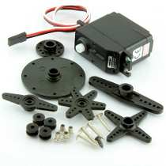

Basically servo drive monitors the feedback signal from the servomechanism and continually adjusts for deviation from expected behavior. In our case that means it maintains constant rotation speed.

Servo motors typically have three wires: power (red), ground (black or brown) and signal (yellow. orange or white).
* Power wire should be connected to the 5V pin on the Arduino board.
* Ground wire should be connected to a ground pin (GND) on the Arduino board.
* Signal pin should be connected to a digital pin on the Arduino board.

In general servos are controlled by PWM (pulse width modulation) signal. You can control rotation speed and direction by changing pulse width.

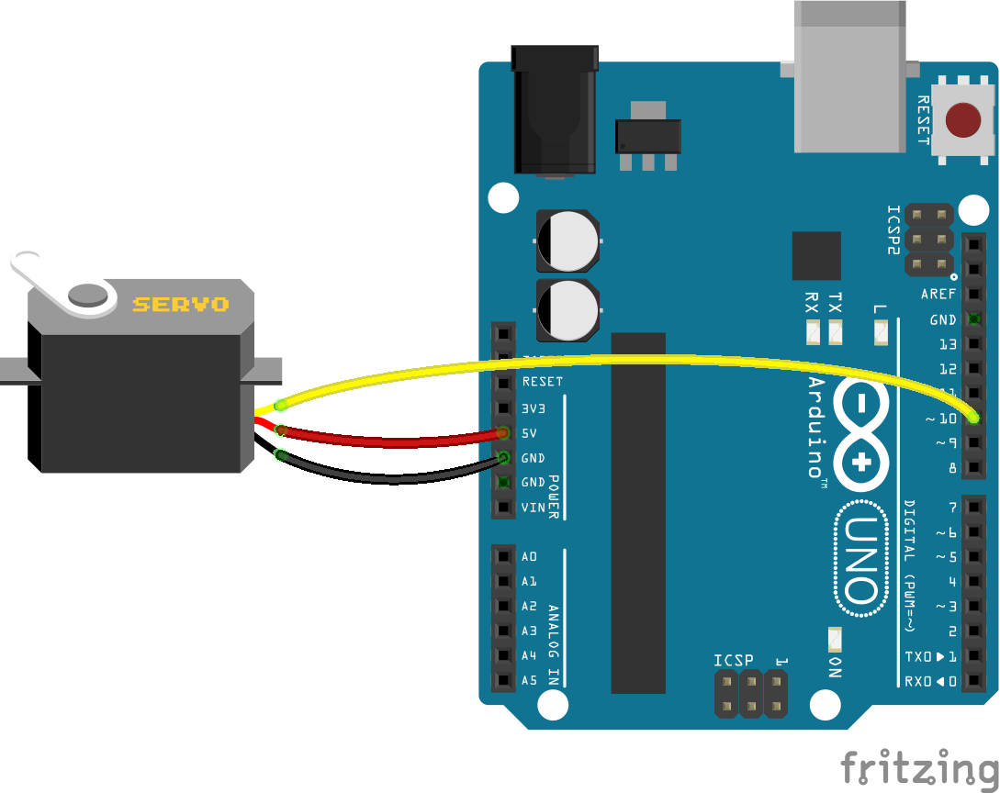

At first you will calibrate servos. It can be done on hardware or software level. In first case you can adjust rotation speed by potentiometer (which can be accessible externally or internally). In second case you can adjust pulse width by changing parameter of writeMilliseconds function. Later you will control two servos, therefore it is easier to calibrate it on hardware level.

Sketch from [Appendix 3](#appendix-3-control-servo) will help us to calibrate servos. Change it to run servo on zero speed and[c] adjust potentiometer position to ensure that at zero speed servo is not rotating.

Then you will connect two servos at once to control them simultaneously. Take a look on following picture.


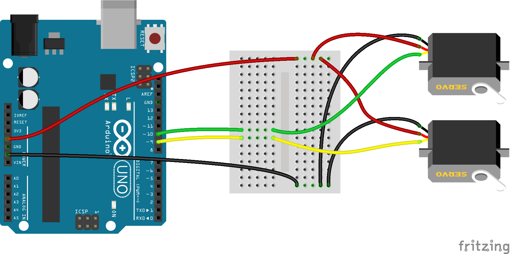

You need to slightly change sketch to control both servos simultaneously. Take a look on it in [Appendix 4](#appendix-4-two-servos).


## Power it with batteries

Until now you used power from USB. Now you will start to use AA batteries in a block of 4 to power robot.

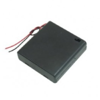

Plug the positive, red cable into VIN, and the negative, black cable into one of the GND pins of Arduino board. Arduino board has built-in voltage regulator and may consume from 5 to 20 volts on VIN pin (recommended from 7 to 12).

Connect altogether as shown on the picture below

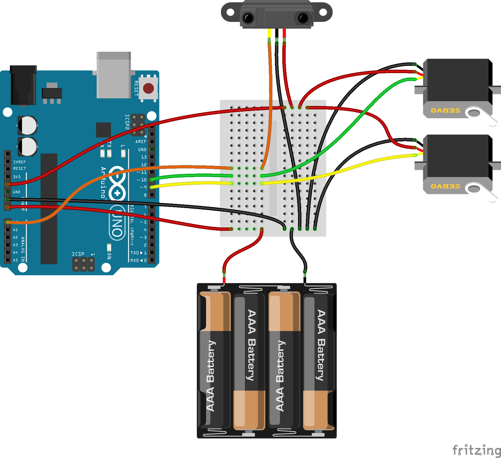

Make sure you connect everything properly and then turn the switch on the battery case to ON.


Note that servos consume considerable power, so if you need to drive more than one or two, you'll probably need to power them from a separate supply (i.e. not the +5V pin on your Arduino). Be sure to connect the grounds of the Arduino and external power supply together.

# Build robot body

Several parts have been prepared to build robot “body”:
1. main parts of construct (cutted from wood or plexiglass)
2. screws and nuts to fix servos, IR sensor and wheels
3. wheels (printed on 3D printer)
4. tires (rubber rings)

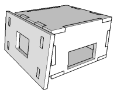

At first fix servos to side panels with screws (12mm M2). Pay attention that servo shaft should align closer to backside of the robot body. Then fix IR sensor on front panel also with screws (6mm M3). Then pull all the wires through holes in front and back panels so that all of them comes out of back panel. Then take mini breadboard and stick it with 2-sided adhesive tape on back panel.


Then fix Arduino board on top panel with three screws (12 mm M2). You can put small piece of material between panel and board to avoid contact of board with surface (or just to fit it better). Or you can use small plastic spacers.


Fix together wheel and round fasteners with screws. Then put rubber ring on the wheel. Put wheel on the servo shaft and fix with screw.


Congratulations! It is almost done!

## Program robot

In first implementation you will try to achieve following:
* avoid obstacles
* avoid table edges


You are restricted to use only one sensor.


On the first picture you can see that in normal state when robot moves along surface the distance to nearest obstacle is equal the distance to surface.

If our robot will reach some object lying on surface the distance is much less than default distance to surface (Lmax).


So the easiest way to reach our first goal is to keep robot moving within this distance range.

Similarly you can reach second goal - avoid table edges. If distance is more than Lmax is is more likely that robot is directing to the table edge.

Lets define two basic rules.
* when distance to obstacle (D) within range Lmin and Lmax robot will move straight forward
* when D is greater than Lmax or less than Lmin robot will rotate until it find direction with D lying within safe range


Robot has 2 wheels. It will drive under the most basic algorithm for a robot - differential drive:
* to drive straight both wheels move forward at same speed
* to drive reverse both wheels move back at same speed
* to turn left the left wheel moves in reverse and the right wheel moves forward
* to turn right the right wheel moves in reverse and the left wheel moves forward

In your case servos are placed in opposite directions so that for one of them robot forward moving means clockwise rotation, for another one - counter-clockwise. Try keep it in mind.


Take a look on example sketch in [Appendix 5. Basic bot](#appendix-5-basic-bot).

Let’s start implementing custom behaviour.

## Stay on distance

Task is change robot behavior so that it hold same distance to obstacle when obstacle is moving back and forth.

## Shuttle run

Your task is to make robot moving forth and back. Main goal is that robot has to move exact distance and return back on start position.

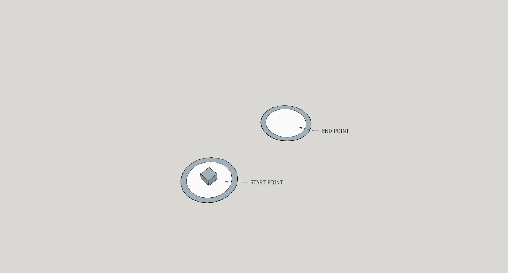

The idea is to implement precise control - moving straight fro N centimeters and rotate exact 180 degrees.

# Move along straight way

Now imagine our robot overcomes a bridge. If you implemented calibration well enough it is not a problem to move straight.

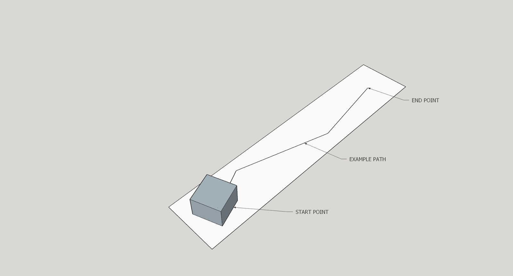

# Snake moving

Imagine you are in tunnel. To find an exit robot will move repeating bends of route. You canl implement kind of PID (proportional-integral-derivative) controller.

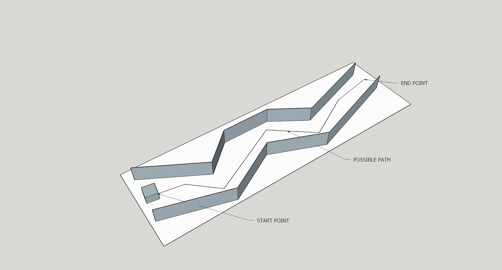


# Advanced flow

## Robotic sumo

Robotic sumo is a kind of competition when robots are trying to put opponent away from a circle. There are different categories (depending on size of robots) and types of rules.

# Line following

Line following is another kind of competitions. Robots are trying to follow the line on the surface with minimum time. Usually it is made with special set of IR sensors directed vertically, which can determine the color or surface just under the sensor. We can implement similar algorithm by using only one distance sensor.


# FAQ


## How does IR distance sensor work?


These rangers all use triangulation and a small linear CCD array to compute the distance and/or presence of objects in the field of view. In order to triangulare, a pulse of IR light is emitted by the emitter. The light travels out into the field of view and either hits an object or just keeps on going. In the case of no object, the light is never reflected, and the reading shows no object. If the light reflects off an object, it returns to the detector and creates a triangle between the point of reflection, the emitter and the detector.
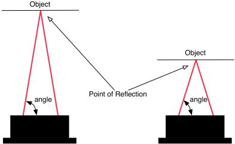

The incident angle of the reflected light varies based on the distance to the object. The receiver portion of the IR rangers is a precision lens that transmits reflected light onto various portions of the enclosed linear CCD array based on the incident angle of the reflected light. The CCD array can then determine the incident angle, and thus calculate the distance to the object. This method of ranging is very immune to interference from ambient light and offers indifference to the color of the object being detected.


## Why do we use servos?
In comparison with DC motor servos can be controlled more easily.


## What is role of PWM in controlling servos?
Take a look on following picture. You may see a signal of rectangular form which has 2 characteristics: pulse width and period.

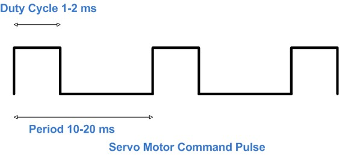

Typically servos are controlled by PWM signal with fixed period. By controlling pulse width we can control servo.

# Links

* How to Build Your First Robot Tutorial http://www.societyofrobots.com/robot_tutorial.shtml
* How to use sharp IR sensor with arduino http://communityofrobots.com/tutorial/kawal/how-use-sharp-ir-sensor-arduino
* Infrared IR ranger comparison http://www.acroname.com/articles/sharp.html
* Sharp GP2Y0A21YK datasheet http://www.sharpsma.com/download/GP2Y0A21YK-DATA-SHEETPDF
* Parallax Continuous Rotation Servo http://learn.parallax.com/KickStart/900-00008
* Pulse WIdth Modulation http://en.wikipedia.org/wiki/Pulse-width_modulation
* Operating Two Servos with the Arduino http://www.robotoid.com/appnotes/arduino-operating-two-servos.html
* Arduino’s Servo Library: Angles, Microseconds, and “Optional” Command Parameters http://makezine.com/2014/04/23/arduinos-servo-library-angles-microseconds-and-optional-command-parameters/
* Powering Arduino with a Battery http://www.instructables.com/id/Powering-Arduino-with-a-Battery
* PID controller http://en.wikipedia.org/wiki/PID_controller
* Sumo Rules http://www.robotroom.com/SumoRules.html
* Line Follower Rules http://www.robotchallenge.org/fileadmin/user_upload/_temp_/RobotChallenge/Reglement/RC-LineFollower.pdf
* Mini Sumo Robot with Proximity Sensors http://mcuoneclipse.com/2013/09/08/mini-sumo-robot-with-proximity-sensors/
* Unified Sumo Robot Rules http://robogames.net/rules/all-sumo.php
* All sources from this tutorial on GitHub https://github.com/zikolach/build-a-bot


# Appendix 1. LED blinking example

```c++
int led = 13; // pin 13 has an LED connected on most Arduino boards.
void setup() { // the setup routine runs once when you press reset:
  pinMode(led, OUTPUT); // initialize the digital pin as an output.
}
void loop() { // the loop routine runs over and over again forever:
  digitalWrite(led, HIGH);   // turn the LED on (HIGH is the voltage level)
  delay(1000);               // wait for a second
  digitalWrite(led, LOW);    // turn the LED off by making the voltage LOW
  delay(1000);               // wait for a second
}
```

# Appendix 2. IR calibration

```c++
int dist_table[][2] = { // calibration table cm to analog value
  {5, 630}, {10, 500}, {15, 340}, {20, 250}, {25, 200},
  {30, 180}, {35, 170}, {40, 140}, {50, 120}, {55, 115},
  {60, 106}, {65, 102}, {70, 98}, {75, 94}, {80, 90}
};
int filter(int prev, int curr) { // filter function
  const float filterVal = 0.1;
  return (int)((float)curr * filterVal + (float)prev * (1 - filterVal));
}
int distance(int pin) { // get current distance from sensor
  const int tries = 10, ms = 1;
  int val = analogRead(pin);
  for (int i = 1; i < tries; i++) { // approximate several values taken with delay
    val = filter(val, analogRead(pin));
    delay(ms);
  }
  int len = sizeof(dist_table) / sizeof(dist_table[0]);
  for (int i = 0; i <= len; i++) { // find closest value in table and interpolate if possible
    if (val >= dist_table[i][1]) {
      if (i > 0) {
        return map(val, dist_table[i][1], dist_table[i-1][1], dist_table[i][0], dist_table[i-1][0]);
      } else {
        return dist_table[i][0];
      }
    }
  }
  return dist_table[len - 1][0];
}
void setup() {
  pinMode(A0, INPUT);
  Serial.begin(9600);
}
void loop() {
  delay(500);
  int curr_dist = distance(A0);
  Serial.print(curr_dist);
  Serial.println("cm");
}
```

# Appendix 3. Control servo

```c++
#include <Servo.h>


#define NEUTRAL 1500 // pulse width for servo at zero speed
#define MAX_SPEED 300 // diff +/- for pulse width between zero and max speed
#define MAX_FORWARD NEUTRAL+MAX_SPEED // pulse width for max counter-clockwise speed
#define MAX_BACKWARD NEUTRAL-MAX_SPEED // pulse width for max clockwise speed


Servo servo; // servo object


int current = NEUTRAL; // current pulse length of control signal in microseconds
int step = 10;         // change pulse width on "step" microseconds at a time


void setup() {
  servo.attach(9); // attach servo to pin 9
  Serial.begin(9600);
  servo.writeMicroseconds(current); // set default speed - servo should stay not moving
  delay(5000);  // for 5 seconds
}
void loop() { // then we start spinning forth and back
  current += step; // changing pulse length
  if (current < MAX_BACKWARD || current > MAX_FORWARD) {
    step = -step;
  }
  servo.writeMicroseconds(current);
  Serial.println(current);
  delay(100);
}
```

# Appendix 4. Two servos

```c++
#include <Servo.h>


#define NEUTRAL 1520 // pulse width for servo at zero speed
#define MAX_SPEED 300 // diff for pulse width between zero and max speed
#define MAX_FORWARD NEUTRAL+MAX_SPEED // pulse width for max counter-clockwise speed
#define MAX_BACKWARD NEUTRAL-MAX_SPEED // pulse width for max clockwise speed


Servo leftServo, rightServo;


int current = NEUTRAL;
int step = 10;


void setup() {
  leftServo.attach(10); // attach left servo to pin 10
  rightServo.attach(9); // attach right servo to pin 9
  Serial.begin(9600);
  leftServo.writeMicroseconds(current);
  rightServo.writeMicroseconds(current);
  delay(5000);
}


void loop() {
  current += step;
  if (current < MAX_BACKWARD || current > MAX_FORWARD) { step = -step; }
  leftServo.writeMicroseconds(current);
  rightServo.writeMicroseconds(current);
  Serial.println(current);
  delay(100);
}
```

# Appendix 5. Basic bot

```c++
#include <Servo.h>


#define NEUTRAL 1500 // pulse width for servo at zero speed
#define MAX_SPEED 300 // diff for pulse width between zero and max speed
#define MAX_FORWARD NEUTRAL+MAX_SPEED // pulse width for max counter-clockwise speed
#define MAX_BACKWARD NEUTRAL-MAX_SPEED // pulse width for max clockwise speed


#define LED 13 // on-board Arduino LED


// Move directions
#define UNKNOWN -1
#define FORWARD 0
#define LEFT 1
#define RIGHT 2
#define BACKWARD 3


// IR sensor values
#define TOO_FAR 300 // to far to obstacle - probably table edge
#define TOO_CLOSE 500 // too close to obstacle


Servo rightServo;
Servo leftServo;


void attachServos() {
  if (!rightServo.attached()) { rightServo.attach(9); }
  if (!leftServo.attached()) { leftServo.attach(10); }
}


void move(int dir) {
  switch (dir) {
    case FORWARD:
      rightServo.writeMicroseconds(MAX_BACKWARD);
      leftServo.writeMicroseconds(MAX_FORWARD);
      break;
    case LEFT:
      rightServo.writeMicroseconds(MAX_BACKWARD);
      leftServo.writeMicroseconds(MAX_BACKWARD);
      break;
    case RIGHT:
      rightServo.writeMicroseconds(MAX_FORWARD);
      leftServo.writeMicroseconds(MAX_FORWARD);
      break;
    case BACKWARD:
      rightServo.writeMicroseconds(MAX_FORWARD);
      leftServo.writeMicroseconds(MAX_BACKWARD);
      break;
    default:
      rightServo.writeMicroseconds(NEUTRAL);
      leftServo.writeMicroseconds(NEUTRAL);
  }
}


int checkDistance() {
  // TODO: implement filter and conversion to cm
  return analogRead(A0);
}


void setup() {
  pinMode(A0, INPUT);
  pinMode(LED, OUTPUT);
  attachServos();
  Serial.begin(9600);
}


int currentDirection = UNKNOWN;


void loop() {
  int sensorValue = checkDistance(); // get value from ir sensor
  // Note: check IR sensor voltage diagram
//  Serial.println(dist); // DEBUG: print distance
  if (sensorValue < TOO_FAR) {
    currentDirection = BACKWARD; // possible table edge - move backward
  } else if (sensorValue > TOO_CLOSE) {
    if (currentDirection == 0) { // too close - rotate
      randomSeed(millis()); // in random direction
      currentDirection = random(1, 3); // LEFT or RIGHT
    }
  } else {
    currentDirection = FORWARD; // otherwise - move forward
  }
  digitalWrite(LED, currentDirection != FORWARD); // indicate danger
  move(currentDirection);
  delay(500); // half-second delay
}
```

[a]In the generated PDF, this routes via google.com, looks suspicious. I'd rather prefer being linked directly to the page.
[b]Not really straightforward how to calibrate. Need a better explanation
[c]The sketch isnt really for calibration. It has additional logic to iterate over speeds/directions. Maybe we should comment those lines, and let the users firstly calibrate, then test the speed/direction iteration.
[d]Maybe a picture here that helps get the wiring right in the final assembled bot?
