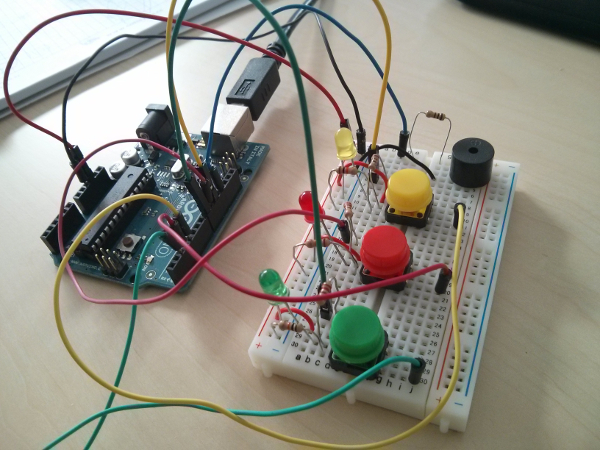
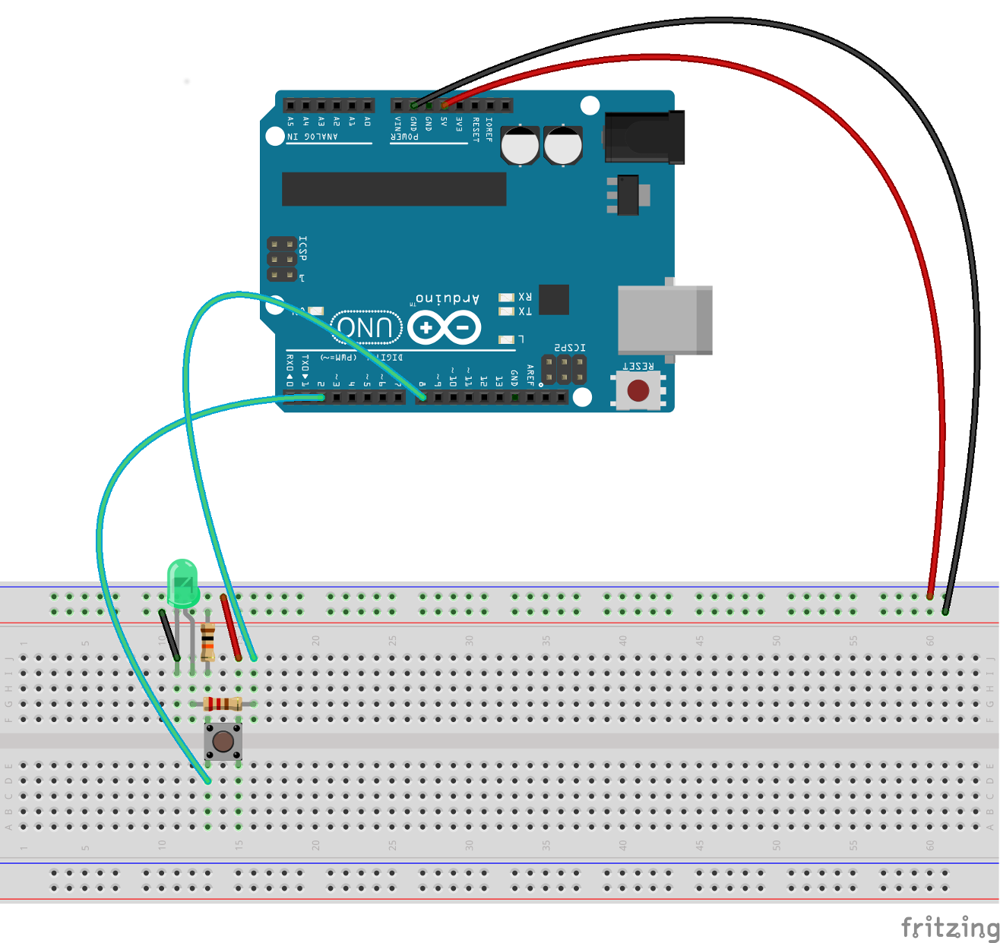
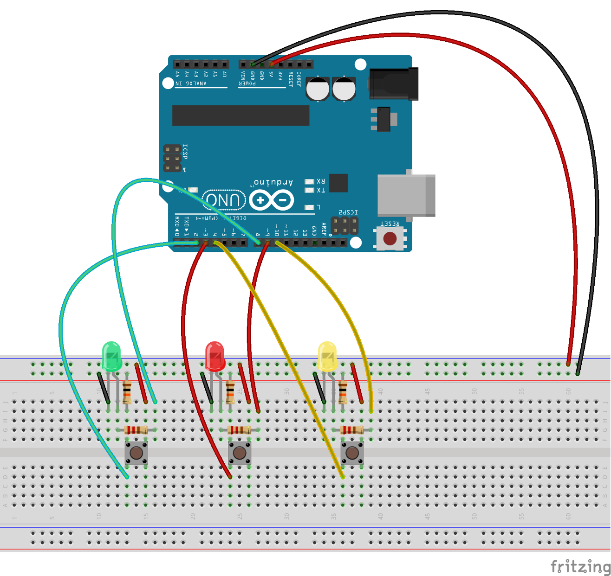
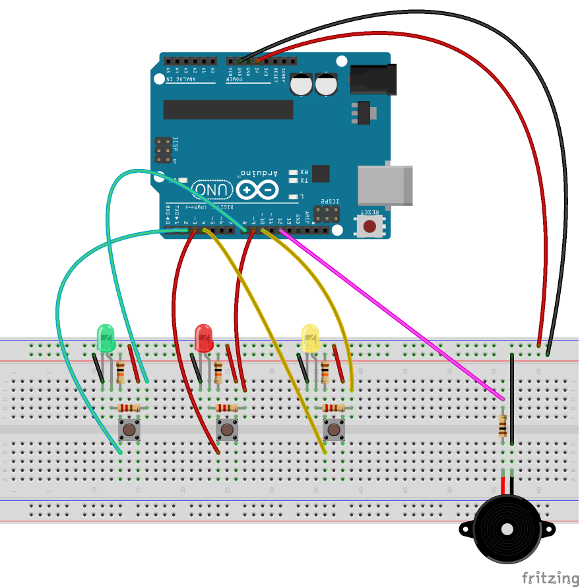

# Spiel' Simon Says mit Arduino

In diesem Workshop werden wir das Spiel [Simon Says](https://de.wikipedia.org/wiki/Simon_says_(Spiel)) mit Arduino nachbauen. Um das Zusammenbauen zu beschleunigen, wurde die Anzahl der Farben auf drei begrenzt, der Code erlaubt es aber sehr leicht neue Farben hinzuzufügen.
In einer Runde des Spiels blinken eine oder mehrere LEDs in zufälliger Reihenfolge und der jeweils zugehörige Ton ist zu hören. Der Spieler/die Spielerin soll danach die Knöpfe in der gleichen Reihenfolge drücken um die Sequenz zu reproduzieren.

> Das wirst du in diesem Workshop bauen.

## Requirements

- 1 x Arduino
- 3 x LEDs in verschiedenen Farben
- 3 x Knöpfe
- 1 x Steckplatine
- 1 x Piezo Lautsprecher
- 3 x 220Ω Widerstände (für LEDs)
- 3 x 10kΩ Widerstände (für Knöpfe)
- 1 x 100Ω Widerstand (für Lautsprecher)
- N x Brücken

### Tools / Equipment

 - Laptop mit installiertem Arduino IDE
 - USB-Kabel um die Sketches auf den Arduino zu laden

## Flow 1 - Erste Schritte

In diesem einfachen Flow werden wir nur überprüfen ob dein Arduino mit der IDE und dem Laptop funktioniert. Wir werden einen simplen Sketch (so werden spezielle Arduino-Programme genannt), der eine LED blinken lässt, hochladen.
Die meisten Arduinos haben eine interne LED, verbunden mit Pin 13 auf dem Board selbst, sodass wir keine weitere Hardware benötigen.

 1. [Lade die IDE herunter](http://arduino.cc/en/Main/Software)
 2. Folge den folgenden Anwendungen basierend auf dem betriebssystem, das du verwendest:
  * [Microsoft Windows](http://arduino.cc/en/Guide/Windows)
  * [Mac OS X](http://arduino.cc/en/Guide/MacOSX)
  * [Linux](http://www.arduino.cc/playground/Learning/Linux)

Toll! Jetzt können wir uns spannenderen Dingen widmen!

## Flow 2 - Arbeiten mit digitalen Pins

In diesem Flow werden wir beginnen die Komponeten mit Hilfe der Steckplatine zu verbinden. Bitte verbinde alle Teile wie in der folgenden Abbildung ersichtlich. Alle verbundenen Steckplätze wurden grün hervorgehoben.

Öffne den Sketch `sketches/flow2.ino` und lade ihn auf das Arduino-Board hoch. Das Ergebnis ist recht simpel: Wenn du den Knopf drückst, leuchtet die LED. Du hast nun gelernt wie man kleine Schaltkreise baut und dich mit der IDE vertraut gemacht.

## Flow 3 - Mehrere digitale Pins

Wir wiederholen und zwei weitere Male, was wir schon in Flow 2 getan haben. So ergeben sich drei LEDs und dazugehörige Buttons.

Knöpfe stabil und sicher mit der Steckplatine zu verbinden kann manchmal etwas knifflig sein. Am besten du drückst sie mit Gefühl an zwei diagonal Liegenden Eckpunkten in die Platine.
Öffne `sketches/flow3.ino` und lade ihn auf das Arduino-Board hoch.

## Flow 4 - Vollständiges Spiel

In diesem letzten Flow wollen wir das Spiel fertigstellen und endlich Spaß beim Spielen haben.
Wir benötigen jetzt auch den Piezo-Lautsprecher, mit dem wir verschiedenste Geräusche machen können.

Das Endergebnis sollte ähnlich aussehen wie auf der Abbildung, du könntest natürlich auch die negativen Pins der LEDs direkt mit der horizontalen Erdung verbinden um dir die drei zusätzlichen Kabelstrecken zu sparen:

Öffne `sketches/flow4.ino` und lade ihn auf das Arduino-Board hoch.

Der Code verwendet die extra Datei `pitches.h` auf der `tone()` basiert. Sie enthält alle Tonlagen für typische Noten. Zum beispiel repräsentiert `NOTE_C4` ein mittleres C und `NOTE_FS4` ist ein F♯ und so weiter. Diese Tabelle wurde von [@bhagman](https://github.com/bhagman) verfasst und wird in [einem Arduino Beispiel](http://arduino.cc/en/Reference/Tone) genauer beschrieben. Sie kann nützlich sein, wenn du Musik ausgeben möchtest.

Viel Spaß!

## Weitere Materialien
 1. [Fritzing](http://fritzing.org)