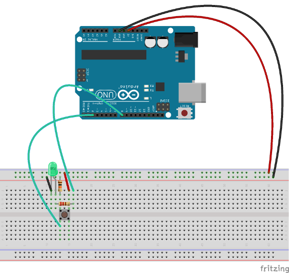
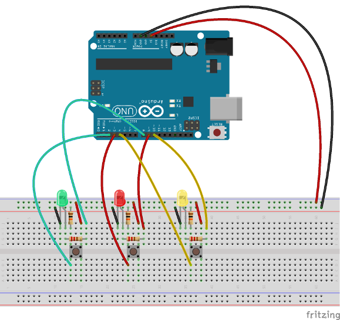

# Play Simon with Arduino

In this workshop we are going to build the [Simon](http://en.wikipedia.org/wiki/Simon_(game)) game with [Arduino](https://ardunio.cc). To make the assembly routine faster, I reduced the size of the available colors to three, but the code will permit very easily to add extra colors.
A round in the game consists of the device lighting up one or more LEDs, and playing a corresponding note, in a random order, after which the player must reproduce that order by pressing the buttons. 

>This is what you will build in this workshop.

## Requirements

- 1 x Arduino
- 3 x LED's of different colours
- 3 x Buttons
- 1 x Breadboard
- 1 x Piezo speaker
- 3 x 220Ω resistors for the LEDs
- 3 x 10kΩ resistors for the buttons
- 1 x 100Ω resistor for the speaker
- N x jumpers

### Tools / Equipment

- Laptops with Arduino IDE installed
- USB cables to load sketches onto Arduino

## Flow 1 - Getting Started

In this simple flow we'll just check that Arduino and the IDE in your machine are fully functional. We are going to upload a simple sketch (that's how Arduino programs are called) that will blink a LED.
Most Arduino boards already have an internal LED attached to pin 13 on the board itself, so there's no need to use any additional hardware yet.

1. Download the IDE at <http://arduino.cc/en/Main/Software>
2. Follow the simple instructions, based on your platform at <http://arduino.cc/en/Guide/Windows>, <http://arduino.cc/en/Guide/MacOSX>, <http://www.arduino.cc/playground/Learning/Linux>

Congratulations! We are now ready to do so more interesting things!

## Flow 2 - Work with digital pins

In this simple flow we'll start to plug the components on the breadboard. Please insert the components as shown in the following picture. You can notice that the connected dots in the breadboards are green. 

Open the sketch flow2 (sketches/flow2.ino) and upload it to the board. It's very simple: when you push the button, the LED is lighted up. The purpose of this sketch is to let you familiarize in creating small circuits on the breadboard and in understanding the basic API of Arduino.

## Flow 3 - More digital pins

Let's just repeat two more times what we did in flow2 two, so to have not one, but three combinations of LED + button.

Stable and secure plugging of the buttons in the breadboard can sometimes be tricky. Push them on the diagonal for maximum stability.
Open the sketch flow3 (sketches/flow3.ino) and upload it to the board.

## Flow 4 - Full game

In this last flow, we'll complete the game and we'll finally have some fun playing with it.
We need to add the Piezo speaker (sometimes also called Buzzer) to provide some fancy sounds.

> Your setup should look similar. You could also connect the lower leg of the LEDs directly to the ground horizontal line of the breadboard. This way you don't have to connect the three little black wires.

Open the sketch flow4 (sketches/flow4.ino) and upload it to the board.

The code uses an extra file, `pitches.h` on which `tone()` is based. This file contains all the pitch values for typical notes. For example, `NOTE_C4` is middle C. `NOTE_FS4` is F sharp, and so forth. This note table was originally taken from [an Arduino example](http://arduino.cc/en/Reference/Tone) and written by [@bhagman](https://github.com/bhagman). You may find it useful for whenever you want to make musical notes.

Have fun!

## Additional resources

1. Fritzing <http://fritzing.org>
